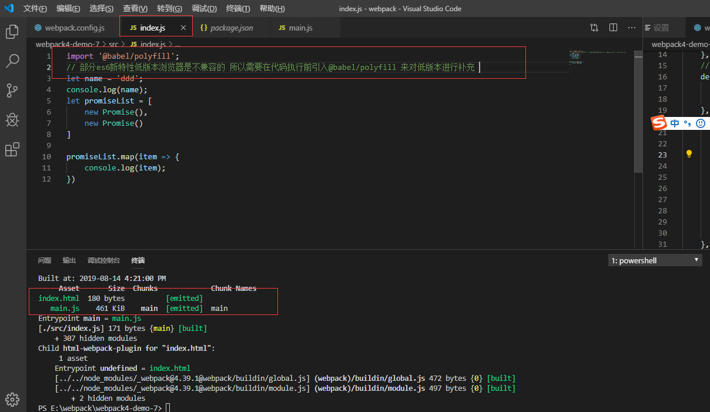
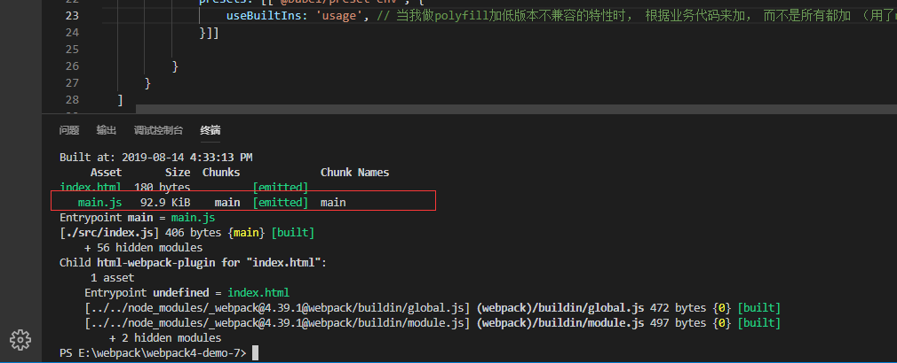

# babel
## 配置里用的webpack-dev-server 想看打包文件 可以直接使用npx webpack命令
## webpack与babel配合 需要安装babel-loader 与、@babel/core

### @babel/core
@babel/core是一种babel的核心库 使babel识别js代码，将js代码转为EST抽象树（层次太深 不是很懂 了解先）

### babel-loader
babel-loader在处理js代码时，只是充当webpack与babel之间的桥梁，并没有真正的帮助webpack将es6语法转成es5语法

### @babel/prest-env
真正将es6语法转为es5的时prest-env 但是某些es6新特性对于低版本浏览器是不能被解析的 所以就需要在代码执行前在引入@babel/polyfill

### @babel/polyfill 
@babel/polyfill 工作时  会将所有语法都执行，所以打包后的文件会非常大


可以做配置
```
module: {
        rules: [
            {
                test: /\.js$/,
                exclude: /node_modules/,
                loader: 'babel-loader', // 处理js文件时 babel-loaser只是webpack与babel之间通信的桥梁，并不会真的帮助webpack将es6语法转为es5，真正转换是由@babel/presset-env做的
                options: {
                    presets: [['@babel/preset-env', {
                        useBuiltIns: 'usage', // 当我做polyfill加低版本不兼容的特性时， 根据业务代码来加， 而不是所有都加 （用了map只加map）
                    }]]
                    
                }
            }
        ]
    },
```
可以看到配置后效果 文件小了好多


### @bable/plugin-transform-runtime
```
module: {
        rules: [
            {
                test: /\.js$/,
                exclude: /node_modules/,
                loader: 'babel-loader', // 处理js文件时 babel-loaser只是webpack与babel之间通信的桥梁，并不会真的帮助webpack将es6语法转为es5，真正转换是由@babel/presset-env做的
                options: {
                    // presets: [['@babel/preset-env', {
                    //     useBuiltIns: 'usage', // 当我做polyfill加低版本不兼容的特性时， 根据业务代码来加， 而不是所有都加 （用了map只加map）
                    // }]]
                    
                    // 使用polyfill时 polyfill会污染全局变量 所以在写业务场景代码下还好 开发库项目时就会出现问题 所以推荐使用plugin-transform-runtime
                    "plugins": [["@babel/plugin-transform-runtime", {

                    }]] // plugin-transform-runtime 用的是闭包的写法 不会污染环境
                }
            }
        ]
    },
```